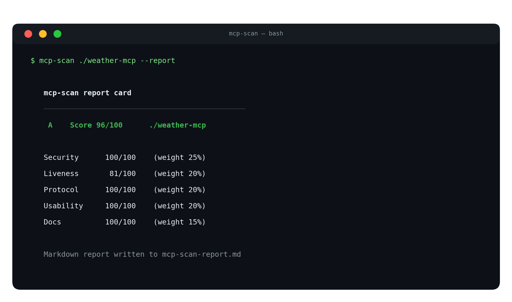

<div align="center">

# 🔍 mcp-scan

**Stop debugging dead MCP servers.** One command grades any MCP server **A–F** on security, liveness, protocol, usability, and docs — then can **probe it live** and **rank the whole ecosystem** on a leaderboard.

[](https://pypi.org/project/mcp-scan/)
[](LICENSE)
[](https://github.com/lipon101/mcp-scan)



</div>

---

The MCP ecosystem has **15,000+ servers** — and roughly **1 in 6 has a verified problem**: dead repos, deprecated packages, stale code, leaked secrets. `mcp-scan` is the fast, opinionated **linter + Lighthouse** you run *before* you wire a server into your agent.

## ✨ Why

- **One command, instant grade.** No config, no signup, <5 seconds.
- **Security first.** Catches hardcoded secrets, committed `.env` files, and `eval/exec` — weighted so a leaky server can never score well.
- **Prove it actually runs.** `--live` launches the server and verifies the real MCP handshake.
- **Shareable report cards.** Export a Markdown card + shields badge for your README or PRs.
- **CI-native.** A GitHub Action + `--fail-under` make it a quality gate that fails the build.
- **Ecosystem leaderboard.** Rank popular servers and publish a public scoreboard.

## 📦 Install

```bash
pipx install mcp-scan                 # core CLI
pipx install "mcp-scan[live]"         # + live protocol probing
pip install "mcp-scan[web]"           # + the leaderboard web dashboard
```

## 🚀 Quickstart

```bash
mcp-scan ./path/to/server                       # grade a local repo
mcp-scan ./path/to/server --report --badge      # + Markdown card + README badge
mcp-scan https://github.com/someone/server      # clone & scan a remote repo
mcp-scan ./path/to/server --json report.json    # machine-readable output
mcp-scan . --fail-under B                       # CI gate
```

## 🔬 Live protocol probing

Static analysis tells you a server *looks* right; `--live` proves it **runs and answers**. It launches the server over stdio and performs a real MCP handshake (`initialize` → `list_tools`):

```bash
pipx install "mcp-scan[live]"
mcp-scan ./path/to/server --live
# optionally control the launch command:
mcp-scan ./path/to/server --live --command "python server.py"
```

Live results (`live_handshake`, `live_lists_tools`) are folded into the **Protocol** score. It's off by default so the core scan stays fast and offline.

## 🏆 Leaderboard

Rank a set of servers (or the whole ecosystem) and publish a scoreboard:

```bash
mcp-scan-leaderboard ./serverA ./serverB --html leaderboard.html --json lb.json
mcp-scan-leaderboard --from-file leaderboard/repos.txt --md leaderboard.md
mcp-scan-leaderboard            # no args → scan the curated list of popular servers
```

Serve it as a live dashboard (deploy to Fly.io / Render / Railway):

```bash
pip install "mcp-scan[web]"
MCP_SCAN_TARGETS=./examples/good_server,./examples/bad_server \
    uvicorn mcp_scan.webapp:app --reload
# → http://127.0.0.1:8000  (HTML)  and  /api/leaderboard  (JSON)
```

## 🤖 GitHub Action

Run `mcp-scan` automatically on every pull request — and fail the build if a server drops below your bar.

```yaml
# .github/workflows/mcp-scan.yml
name: mcp-scan
on: [push, pull_request]
jobs:
  scan:
    runs-on: ubuntu-latest
    steps:
      - uses: actions/checkout@v4
      - uses: lipon101/mcp-scan@v1
        id: scan
        with:
          fail-under: B
      - name: Show grade
        if: always()
        run: echo "Grade ${{ steps.scan.outputs.grade }} (${{ steps.scan.outputs.score }}/100)"
```

Every repo that adds this Action becomes a **dependent** — visible under *Insights → Dependents*. New servers can start from **[mcp-server-template](https://github.com/lipon101/mcp-server-template)**, which has this gate pre-wired.

## 🧪 What it checks

| Category | Weight | Examples |
|---|---|---|
| 🔒 **Security** | 25% | hardcoded secrets, committed `.env`, `eval/exec`, declared dependencies |
| 🫀 **Liveness** | 20% | project exists, git present, recent commits, not deprecated |
| 🔌 **Protocol** | 20% | detectable entrypoint, declared tools, valid `mcp.json`, documented transport, **live handshake** |
| 🧰 **Usability** | 20% | README, install steps, runnable example, clear value prop, config example |
| 📚 **Docs** | 15% | license, substantive README, examples, changelog, contributing guide |

Grades: **A** ≥ 90 · **B** ≥ 80 · **C** ≥ 65 · **D** ≥ 50 · **F** < 50.

## 🤝 Contributing

Contributions are welcome! See [CONTRIBUTING.md](CONTRIBUTING.md). Add a check in `mcp_scan/checks/`, add a test, open a PR. Ready to ship? See [LAUNCH.md](LAUNCH.md).

## 📄 License

[MIT](LICENSE) © 2026 James D. Owens.
